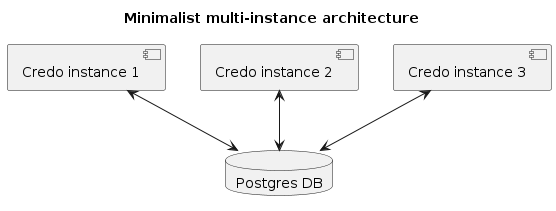
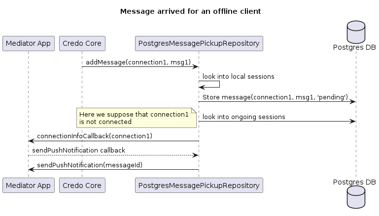

# Postgres Message Pickup repository for Credo

## Overview

This package provides a simple but efficient Message Pickup Repository implementation to use with a [Credo](https://github.com/openwallet-foundation/credo-ts) mediator that wishes to persist queued messages for offline users in a shared database that will allow using multiple Credo instances. And everything without the need of using extra components, since the same Postgres database host used to store Credo wallet can be used for the Pickup Messages database!



## Features

- Message storage and retrieval: save and fetch messages from a PostgreSQL database.

- Pub/Sub integration: automatically notify other instances about new messages that arrived to a certain client

- Live session management: handle [Message Pickup V2 Live sessions](https://github.com/hyperledger/aries-rfcs/tree/main/features/0685-pickup-v2#live-mode) for efficient message delivery

- Automatic database initialization: set up the database structure required for message operations at startup

- Pluggable support for Push notifications: provide your own callback that be called whenever a message has arrived for an offline user (not connected to any instance)


## How does it work?

`PostgresMessagePickupRepository` creates two tables in its PostgreSQL database: one to store the queued messages, and another one to keep track of Live sessions when clients connect and disconnect from it. It also registers to a [PG PubSub](https://github.com/voxpelli/node-pg-pubsub) channel to be notified when a message arrives (for any connection).

When a new message for a certain DIDComm connection is added to the queue, `PostgresMessagePickupRepository` looks if there is an existing session with it:

- If there is a local Live mode session, it will pack and deliver the message directly, adding it to the persistent queue with a particular status flag (`sending`) to reflect that it is expected to be delivered and acknowledged soon
- If there is not any local session, the client could be connected to another instance. Therefore, it adds the message to the persistent queue and looks into the shared message pickup session database:
  - If there is a session registered to another instance, it will publish a notification
  - If not, it will trigger the callback to send a push notification (if supported)

> **Note**: at the moment, all instances are notified when a message arrives for any online DIDComm connection. A possible improvement could be to create a channel per connection, so only the instance connected to that client is triggered. But it is uncertain for us yet how well it would scale when there is a large number of connected users at the same time.

The following diagrams show the operation when messages arrive in both online and offline scenarios.




## Installation

This module is designed to work with Credo 0.5.X. Newer versions may include breaking changes in its API and therefore would require code updates to this module.

To use it, install package in your DIDComm Mediator application. For example:

```bash
npm i @2060.io/credo-ts-message-pickup-repository-pg
```
or 
```
yarn add @2060.io/credo-ts-message-pickup-repository-pg
```

## Usage

Setting up PostgresMessagePickupRepository is quite simple if you have some prior experience with Credo. We can summarize it in three steps: create, initialize and inject into a Credo instance.

### Constructing the Repository

You need to instance `PostgresMessagePickupRepository` with explicit database configuration (remember: it could be the same used for Credo wallet). If `postgresDatabaseName` is not specified, default `messagepickuprepository` will be used (if it does not exist, it will try to automatically create it using the provided credentials).


```ts
const messageRepository = new PostgresMessagePickupRepository({
  logger: yourLoggerInstance,
  postgresUser: 'your_postgres_user',
  postgresPassword: 'your_postgres_password',
  postgresHost: 'your_postgres_host',
  postgresDatabaseName: 'your_database_name',
})
```

### Initializing the Repository

To start using the `PostgresMessagePickupRepository`, initialize it with an agent and a callback function for retrieving connection information.

This callback must return another callback function that will be called by `PostgresMessagePickupRepository` when it determines that a Push Notification must be sent. It is a generic approach that makes you free to implement the Push notification service you want.

Note that in this example, notification token is stored as a tag in connection records, so it is used to determine whether to create a Push notification callback or not for a given DIDComm connection.

```ts
const connectionInfoCallback = async (connectionId) => {
          const connectionRecord = await this.agent.connections.findById(connectionId)
          const token = connectionRecord?.getTag('device_token') as string | null
          return {
   sendPushNotification: token ? (messageId) => { this.notificationSender.send(token, messageId }: undefined,
 }
}
await messagePickupRepository.initialize({ agent, connectionInfoCallback })
```

### Injecting into an Agent instance

This full example shows how `PostgresMessagePickupRepository` is created an initialized alongside an `Agent` instance:

```javascript
import { Agent, MediatorModule, MessagePickupModule } from '@credo-ts/core'
import { agentDependencies } from '@credo-ts/node'
import { MessageForwardingStrategy } from '@credo-ts/core/build/modules/routing/MessageForwardingStrategy'
import { PostgresMessagePickupRepository } from './PostgresMessagePickupRepository'

const messagePickupRepository = new PostgresMessagePickupRepository({
  postgresHost: 'postgres',
  postgresUser: 'user',
  postgresPassword: 'pass',
})
const agent = new Agent({
  dependencies: agentDependencies,
  config: { label: 'Test' },
  modules: {
    mediator: new MediatorModule({ messageForwardingStrategy: MessageForwardingStrategy.QueueOnly }),
    messagePickup: new MessagePickupModule({
      messagePickupRepository,
    }),
  },
})

const notificationSender = // { your implementation of a Push notification service here }
const connectionInfoCallback = async (connectionId: string) => {
  const connectionRecord = await agent.connections.findById(connectionId)

  const token = connectionRecord?.getTag('device_token') as string | null

  return {
    sendPushNotification: token
      ? (messageId: string) => {
          notificationSender.send(token, messageId)
        }
      : undefined,
  }
}

await messagePickupRepository.initialize({ agent, connectionInfoCallback })
await agent.initialize()
```

As you can see, all you have to do is to set up your Credo agent's `ForwardingStrategy` to to `QueueOnly` and provide a `PostgresMessagePickupRepository` instance (with the appropriate callbacks) to `MessagePickupModuleConfig`. Then, initialize both your agent and PostgresMessagePickupRepository` and have fun!
